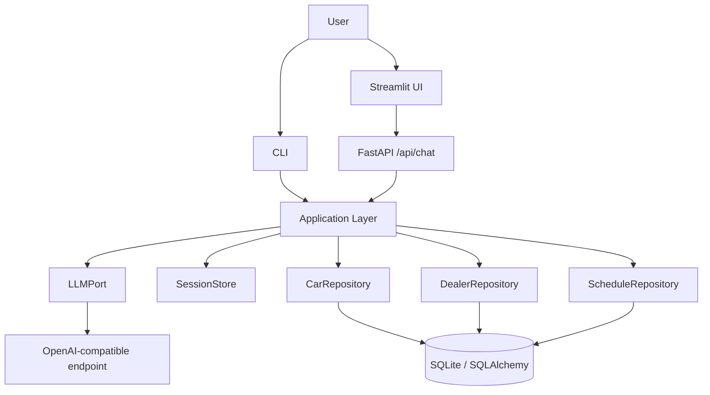
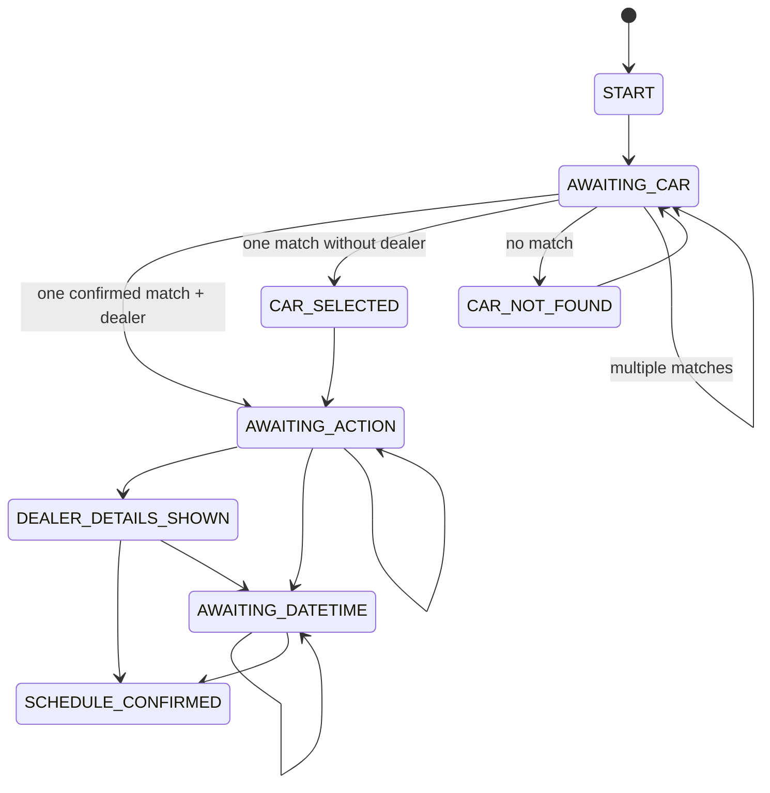

# Architecture

This project is a clean-architecture implementation of the car-dealer chatbot
from the project brief. The core rule is simple: the LLM helps interpret the
user's text, but it never owns the workflow and it never invents car or dealer
data. SQL-backed repository results are authoritative, and the session store is
the only owner of conversation state.

## System View



## Layering

| Layer | Purpose | Examples |
| --- | --- | --- |
| `DTO/` | Boundary contracts for incoming and outgoing transport payloads | `DTO.inputs.chat.ChatRequest`, `DTO.outputs.chat.ChatResponse` |
| `models/` | Internal data contracts shared between workflows, prompts, and repositories | `models.inputs.task.TaskDecision`, `models.outputs.car.CarSearchResult` |
| `domain/` | Business rules, entities, enums, and validation | `domain.entities.schedule.Schedule`, `domain.enums.workflow_state.WorkflowState` |
| `application/` | Use cases, workflow coordination, task routing, and session orchestration | `HandleUserMessageUseCase`, `TaskRouter`, task workflows |
| `ports/` | Abstract interfaces for external effects | `LLMPort`, `SessionStore`, repositories |
| `infrastructure/` | Concrete adapters for storage, LLM calls, prompts, and persistence | SQLAlchemy repos, in-memory session store, OpenAI-compatible client |
| `presentation/` | User-facing entrypoints and transports | CLI, FastAPI, Streamlit |
| `config/` | Settings and logging configuration | `Settings`, `configure_logging` |

The dependency direction always points inward. The application layer sees only
ports and contracts, never concrete frameworks or vendor SDK types.

## One Turn of Conversation

1. A user message arrives through the CLI or FastAPI.
2. The session is loaded or created.
3. The LLM classifies the intent into one of three tasks: item lookup, dealer
   details, or schedule call.
4. The `TaskRouter` checks whether that task is legal from the current
   workflow state.
5. The selected use case runs.
6. Repository data confirms the authoritative result.
7. The workflow state advances legally.
8. The updated session is saved.
9. A `ChatResponse` is returned with reply text, state, and suggested actions.

## Task Flows

### 1. Item Lookup

- The LLM extracts make, model, variant, and optional year range.
- The application normalizes the extracted values.
- The car repository searches the generated catalog.
- Outcomes:
  - one match: return the car and its dealer, set `AWAITING_ACTION`
  - multiple matches: ask the user to disambiguate, keep `AWAITING_CAR`
  - no match: explain that nothing matched, set `CAR_NOT_FOUND`

### 2. Dealer Details

- The use case requires a selected dealer in the current session.
- If no dealer is selected, the bot answers in-band instead of crashing.
- If the dealer row exists, the response is built from repository data.
- Incomplete dealer rows stay usable; missing fields are shown as partial data
  rather than causing a failure.

### 3. Schedule Call

- The use case requires a selected dealer and car.
- The LLM extracts raw date/time/timezone text.
- The application merges partial scheduling context across turns.
- The domain layer parses and validates the requested slot.
- Outcomes:
  - complete and valid: persist a `ScheduleRecord`, confirm the appointment
  - missing or ambiguous data: ask a targeted clarification question
  - invalid or past date/time: reject before persistence

No real external booking is performed. Scheduling is local-only persistence.

## Workflow State Machine



The state machine is enforced by application code, not by the LLM.

## LLM Boundary

Every model call goes through `ports.llm.LLMPort`.

- The configured provider is selected by `infrastructure.llm.factory`.
- The concrete adapter is `OpenAICompatibleClient`.
- The adapter accepts any OpenAI-wire-compatible endpoint through `.env`
  configuration.
- Provider failures degrade to deterministic fallback outputs instead of
  crashing request handlers.

That design keeps model choice and model transport entirely outside the core
business logic.

## Data Design

The generated dataset is deterministic and intentionally contains both normal
rows and adversarial rows.

- `data/cars.csv`: 156 rows
- `data/dealers.csv`: 14 rows
- `data/aliases.csv`: 33 rows

Seeded edge-case rows include:

- `C-9002`: car with no variant and non-standard price formatting
- `C-9004 -> D-999`: car whose dealer reference does not resolve
- `D-012`: dealer row with incomplete contact information
- `D-013`: dealer with no cars

The generated alias data allows user phrasing such as `B.M.W.`, `Merc`, and
`C Class` to resolve to canonical catalog entries.

## Interfaces

The project exposes three user-facing entrypoints.

- CLI: install the package and run `cardealer`
- API: run `uvicorn presentation.api.main:app --reload`
- Streamlit UI: run `streamlit run src/presentation/streamlit/app.py`

The CLI talks directly to the application layer. The Streamlit UI talks only
to the FastAPI API.

## Installability

The project is packaged as `wn-cardealer-chatbot` with a `src/` layout and an
installable console script:

```bash
pip install -e .
cardealer
```

The distribution metadata lives in `pyproject.toml`, and the console script is
registered as `cardealer = presentation.cli:main`.